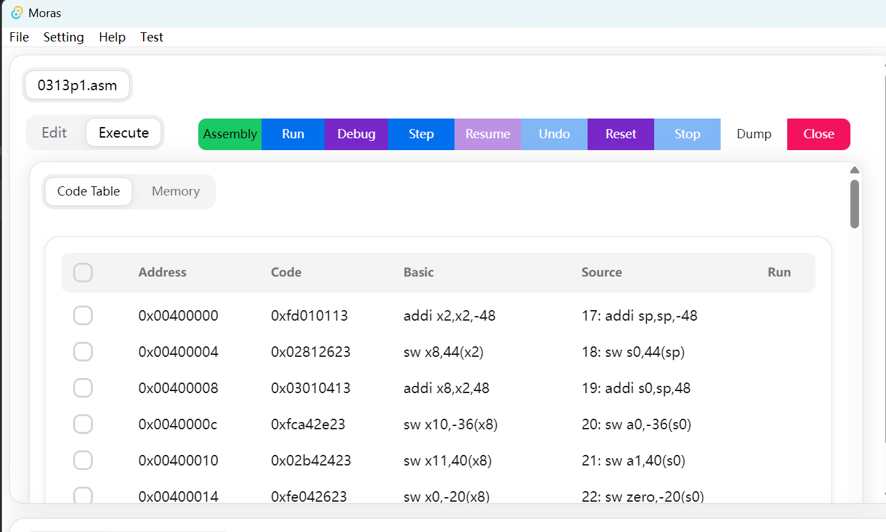
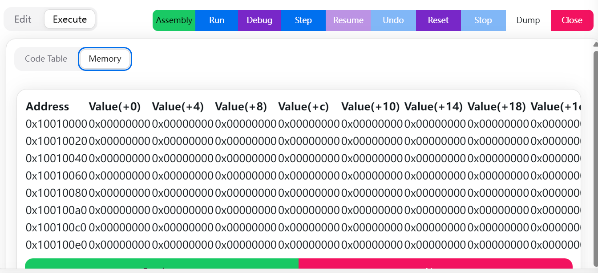
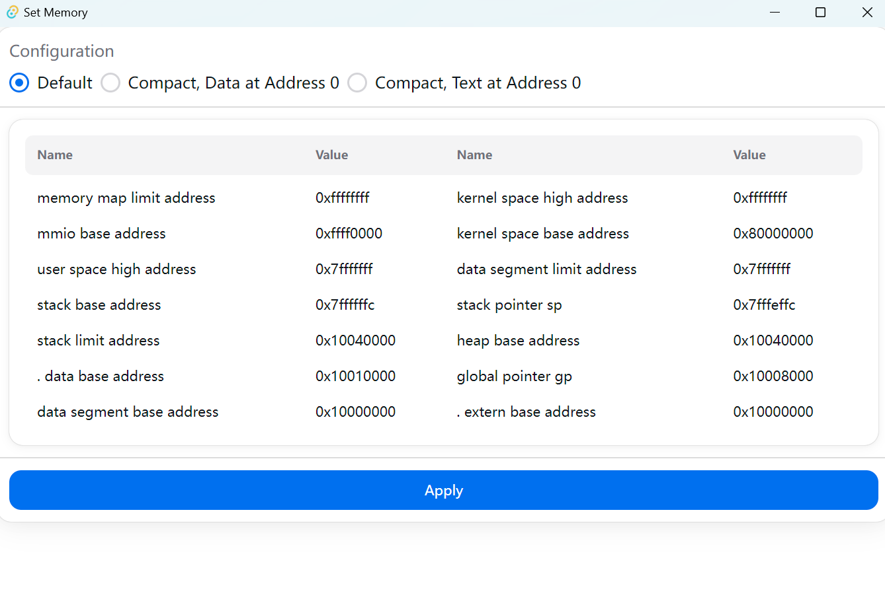
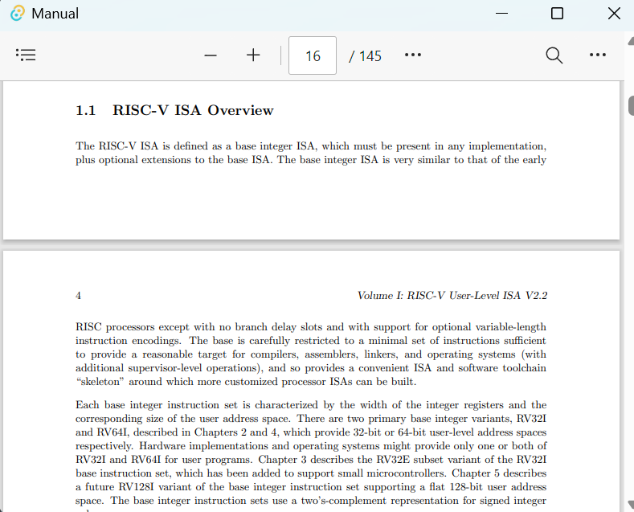

# Usage

> Maximize your efficiency with Moras. Here, we explain how to use the IDE to its full potential. Whether it’s writing 
> code, inspecting memory, or accessing documentation, this section helps you become proficient with the IDE’s tools.

## Writing Code

**Effortless Coding with MORAS**:

 

Writing code in MORAS is a breeze. Our IDE provides a responsive editor with syntax highlighting, making it easy to 
write, read, and understand your code. The auto-indentation feature ensures that your code is not only functional but 
also neatly organized. Whether you're working on a small assignment or a large project, MORAS adapts to your needs, 
providing a seamless coding environment.

Then, click the `Assembly`.

 

And change to `Execute`, you can see the assembly result here.

## Inspecting Memory

**Deep Dive into Your Program's Memory**:

Understanding how your program interacts with memory is crucial in computer organization.

Not only providing memory table, Moras also comes equipped with a 'memory setting' feature that allows you to inspect 
memory and register values at any point during execution.

 

This powerful tool gives you insights into the state of your program, helping you to debug and optimize your code 
effectively.

## Using Documentation

**Instant Access to Information**: 

Built-in documentation is at the core of MORAS.

 

With quick access to language references, API documentation, and user guides, you'll have all the information you need 
at your fingertips. This feature is especially useful when learning new concepts or when you need a quick refresher on 
a particular topic. The documentation is constantly updated to ensure you have the most current and relevant 
information.

Also, there are also some general documents for your reference

[Environment Call](environment_call.md)

[Assembler Directives](assembler_directives.md)

[Supported Instructions](supported_instructions.md)

